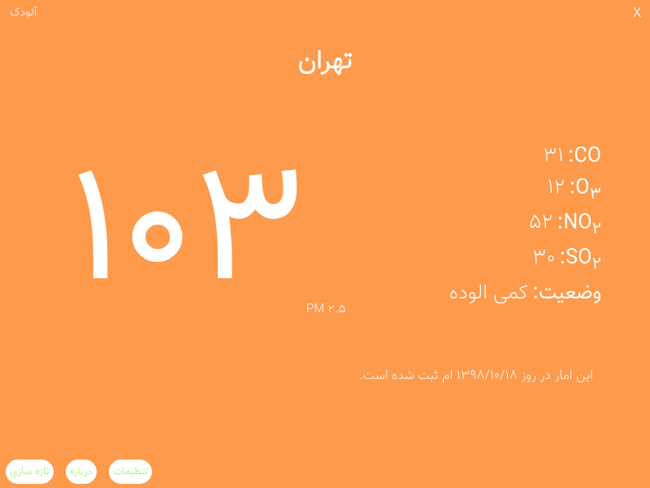

# آلودک

یه اپ الکترون دارای رابط کاربری که توسط من نوشته شده که الایندگی بیشتر شهرهای ایرانو با یه سری جزییات نشون میده و کارتون رو راحت میکنه 
## نصب 
 با ران کردن دستور های زیر, به صورت دولوپمنت رانش کنید و میتونید در توسعه اش به  ما کمک کنید
 و یا با استفاده از الکترون پیکیجر اونو برای سیستم عاملتون بیلد کنید

    // به پوشه خود پروژه برید
    npm install .
    npm start .

## اون آلودک 
[نسخه دیگه آلودک](https://gitlab.com/frowzyispenguin/aloodak) که اول  توسط [منجمد](https://gitlab.com/frowzyispenguin) نوشته شده و برای ترمینال هست
## توسعه 

 - Electron
 - animate.css
 - bootstrap grid system
 - cheerio 
 - puppeteer
 - node-notifier

اینا ابزار هایی هستند که میتونید از اونها در توسعه آلودک گرافیکی کمک کنید
